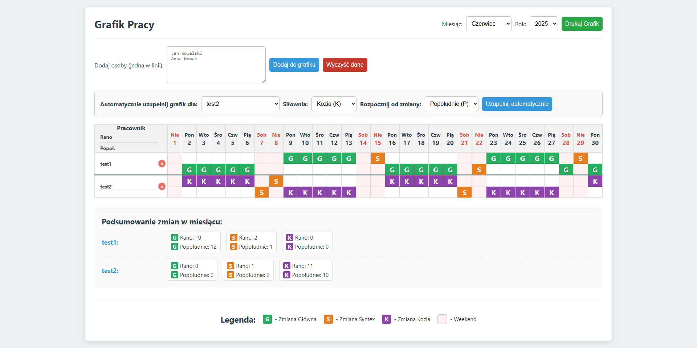

# Generator Grafiku Pracy 🗓️

Prosta i intuicyjna aplikacja webowa do zarządzania grafikami pracy dla wielu pracowników. Umożliwia łatwe planowanie zmian (rannych/popołudniowych) w różnych lokalizacjach ("Główna", "Syntex", "Kozia"), automatyczne uzupełnianie grafiku oraz generowanie podsumowań miesięcznych. Idealne narzędzie dla małych zespołów lub do użytku osobistego. 💪

## Spis Treści

- [Cechy](#cechy)
- [Technologie](#technologie)
- [Jak uruchomić projekt lokalnie?](#jak-uruchomić-projekt-lokalnie)
- [Użycie](#użycie)
- [Podgląd / Live Demo](#podgląd--live-demo)
- [Ważna Uwaga Projektowa](#ważna-uwaga-projektowa)
- [Licencja](#licencja)

## Cechy

* **Interaktywny Kalendarz:** Dynamiczne generowanie kalendarza dla wybranego miesiąca i roku. 📅
* **Zarządzanie Pracownikami:** Łatwe dodawanie i usuwanie pracowników. ➕➖
* **Planowanie Zmian:** Kliknij, aby przypisać zmiany (Rano/Popołudnie) do siłowni (G/S/K) w poszczególnych dniach. 🖱️
* **Automatyczne Uzupełnianie:** Funkcja automatycznego generowania grafiku dla wybranego pracownika na cały miesiąc, z możliwością określenia siłowni i początkowej zmiany. 🤖
* **Podsumowanie Miesięczne:** Automatycznie generowane podsumowanie zmian dla każdego pracownika, z rozbiciem na typ zmiany i siłownię. 📊
* **Drukowanie:** Przyjazny dla druku widok grafiku i podsumowania. 🖨️
* **Lokalne Przechowywanie Danych:** Wszystkie dane (pracownicy i grafik) są automatycznie zapisywane w pamięci lokalnej przeglądarki (`localStorage`), dzięki czemu są dostępne po ponownym otwarciu aplikacji. 💾

## Technologie

Projekt został zbudowany przy użyciu podstawowych technologii webowych:

* **HTML5:** Struktura strony. 🏗️
* **CSS3:** Stylizacja i responsywny wygląd. 🎨
* **JavaScript (ES6+):** Logika aplikacji, interakcje i zarządzanie danymi. 🧠

Brak zewnętrznych bibliotek czy frameworków, co sprawia, że jest lekki i łatwy do zrozumienia. ✨

## Jak uruchomić projekt lokalnie?

Ten projekt to pojedynczy plik HTML, który zawiera w sobie style CSS i skrypty JavaScript. Aby go uruchomić:

1.  **Sklonuj repozytorium:**
    ```bash
    git clone https://github.com/Flamstak/Grafik-pracy-silownia.git
    ```

2.  **Otwórz plik `index.html`:**
    Przejdź do sklonowanego folderu i po prostu otwórz plik `index.html` w swojej ulubionej przeglądarce internetowej (np. Chrome, Firefox). 🌐

Aplikacja powinna od razu się załadować i być gotowa do użycia. 👍

## Użycie

1.  **Wybierz Miesiąc i Rok:** Użyj rozwijanych list na górze, aby wybrać miesiąc i rok, dla którego chcesz stworzyć grafik. 🗓️
2.  **Dodaj Pracowników:** Wpisz imiona i nazwiska pracowników (jedno na linię) w polu tekstowym i kliknij "Dodaj do grafiku". ✍️
3.  **Planuj Zmiany:** Kliknij dwukrotnie (lub wielokrotnie) na komórkę zmiany (Rano/Popołudnie) w kalendarzu, aby cyklicznie przełączać się między siłowniami (Główna, Syntex, Kozia) lub usunąć zmianę. 🔄
4.  **Automatyczne Uzupełnianie:** Wybierz pracownika, siłownię i początkową zmianę w sekcji "Automatycznie uzupełnij grafik", a następnie kliknij "Uzupełnij automatycznie". ⚙️
5.  **Usuń Pracownika:** Kliknij symbol `&times;` (X) obok nazwiska pracownika, aby go usunąć wraz z całym jego grafikiem. 🗑️
6.  **Wyczyść Dane:** Przycisk "Wyczyść dane" usuwa wszystkich pracowników i cały grafik. Używaj ostrożnie! ⚠️
7.  **Drukuj Grafik:** Kliknij "Drukuj Grafik", aby przygotować widok do druku. 🖨️

## Podgląd / Live Demo

Aplikację możesz zobaczyć w akcji pod adresem:
👉 [https://flamstak.github.io/Grafik-pracy-silownia/](https://flamstak.github.io/Grafik-pracy-silownia/)

**